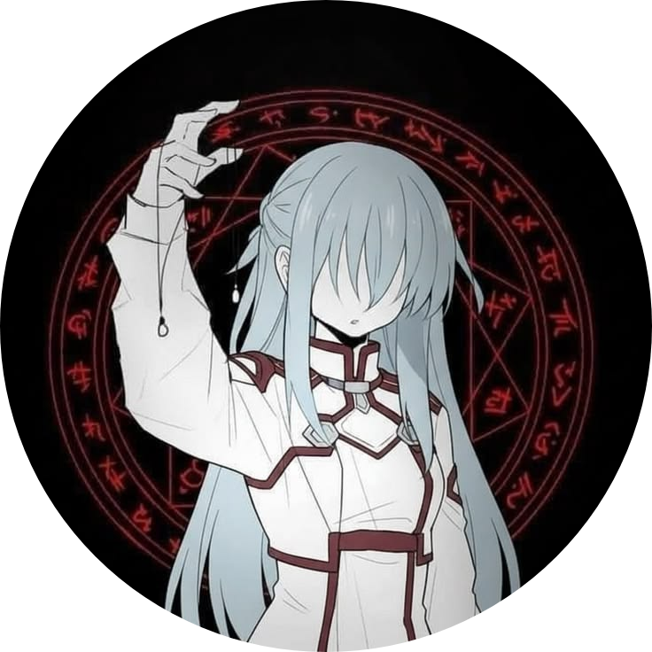

 

# ShadowRPC

**Discord Rich Presence for whatever you are doing on your phone.**

ShadowRPC watches which app is in the foreground and mirrors it to your Discord profile
as *Playing &lt;game&gt;* — using the same OAuth2 + gateway stack that powers
[LunarTune](https://github.com/cognitiveshadows03/LunarTune)'s "Listening to" presence.

## Features

| | Status |
|---|---|
| **App Detection** – pick the apps/games you want to share; ShadowRPC shows the one in the foreground | ✅ |
| Activity type (Playing / Listening / Watching / Competing), activity name, online status | ✅ |
| Optional app icon + elapsed time on the presence | ✅ |
| Material You theming, seed colours, pure black | ✅ |
| Media RPC (now-playing from any player) | 🔜 |
| Custom RPC / Console RPC | 🔜 |

No bot, no Discord user token: you sign in with Discord's OAuth2 (PKCE) and the app talks to
Discord with the resulting scoped token, exactly like a desktop game would.

## FAQ

**Why does it need Usage access?** That is the only Android API that reports the foreground
app without an accessibility service. It is granted in *Settings → Special app access → Usage access*
and can be revoked anytime; ShadowRPC stops itself when it is.

**Nothing shows up on my profile.** Discord only shows presence from a device that has the
"Share detected activities" toggle on and no other client overriding it. Check *Logs* in the drawer.

**Android 10 support?** Yes — minSdk 26; the detection loop runs in a foreground service.

## Credits

- [LunarTune](https://github.com/cognitiveshadows03/LunarTune) — Discord gateway / OAuth code (GPL-3.0)

## License

GPL-3.0 — see [LICENSE](LICENSE).
