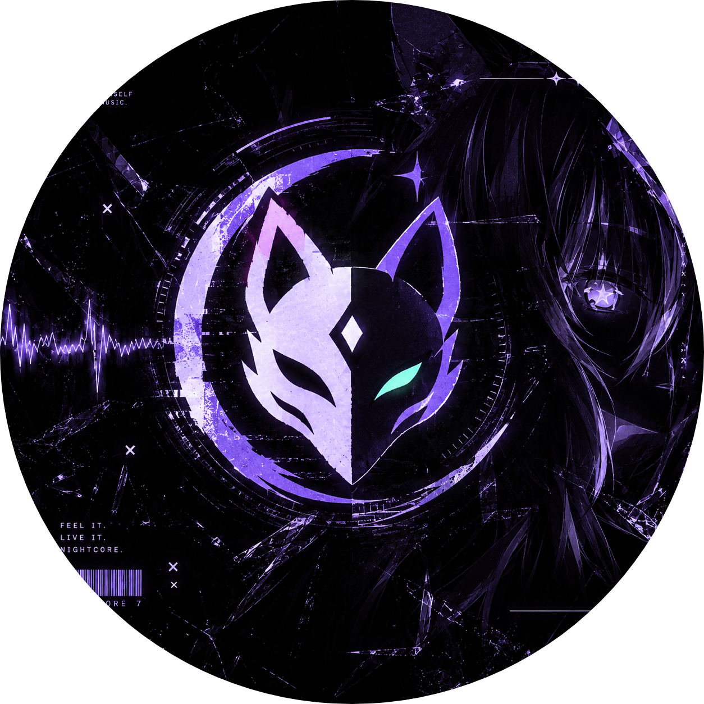
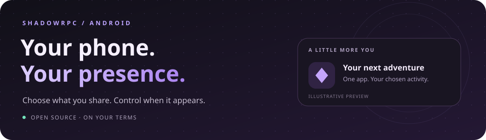
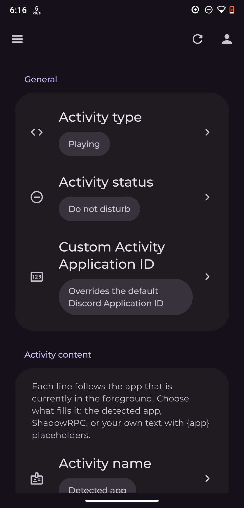
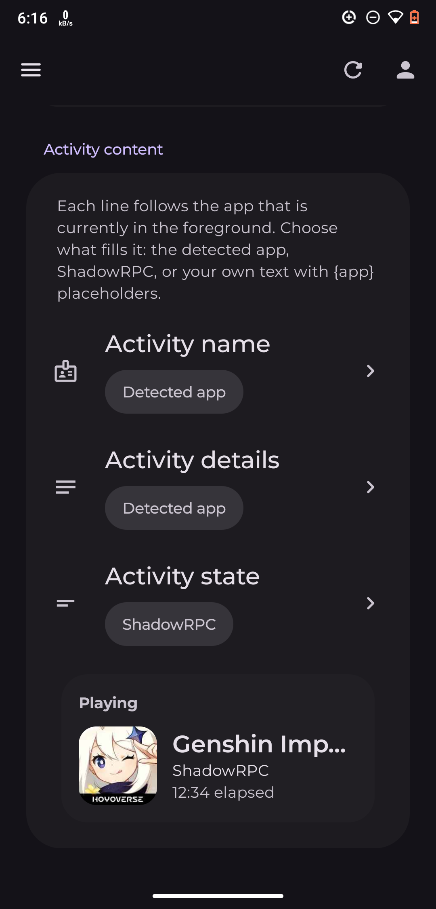
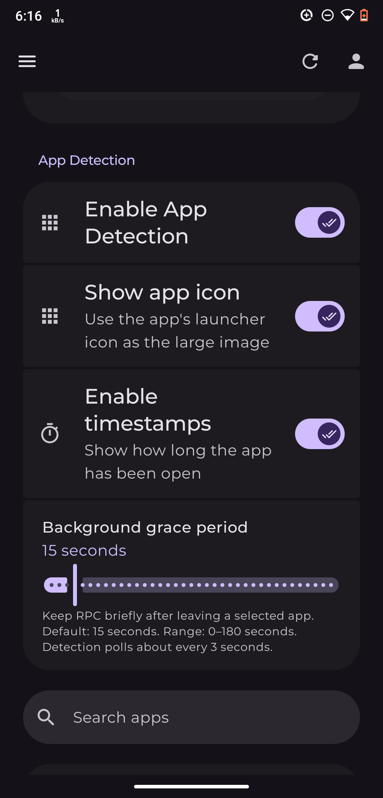
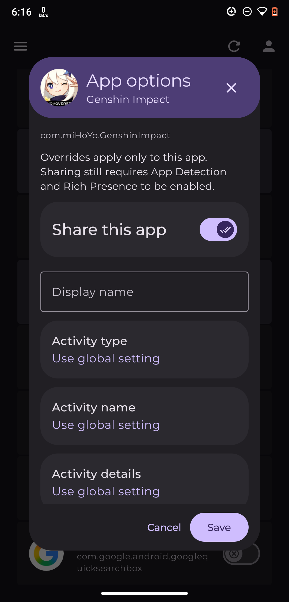

# ShadowRPC

**Discord Rich Presence, from your side of the screen.**

[**Download stable**](https://github.com/TherealCitali/ShadowRPC/releases/latest) · [**Try a prerelease**](https://github.com/TherealCitali/ShadowRPC/releases) · [**Report an issue**](https://github.com/TherealCitali/ShadowRPC/issues)

ShadowRPC turns your selected foreground apps into Discord activity. Pick what belongs on your profile, give each app its own personality, and pause sharing whenever you want.

**No bot setup. No pasted Discord user tokens.** Sign in through Discord OAuth2 with PKCE; ShadowRPC uses that scoped session to publish your activity.

> **Release note:** This README describes current `main`. Miuix elastic overscroll is available in newer prereleases; the original stable **v1.0.0** does not include it.

## A presence that feels like you

| Make it yours | Keep control |
| :--- | :--- |
| **Choose your apps** — share only the apps and games you select. | **One-tap master switch** — toggle from the app, notification Stop action, or Quick Settings tile. |
| **Choose your activity** — Playing, Listening, Watching, or Competing. | **Take a break** — pause for 15 minutes, an hour, or until you resume. |
| **Write your own lines** — app names, categories, package names, or custom templates. | **Clear on lock** — optionally stop showing activity when the screen turns off or locks. |
| **Go app by app** — override names, activity types, and text for individual apps. | **Set the grace period** — keep activity briefly after leaving an app; 15 seconds by default, adjustable from 0–180 seconds. |
| **Add the finishing touches** — optional app icons and elapsed time. | **Bring your settings along** — validated JSON import/export, without session credentials or logs. |

Turning master RPC **Off** stops the watcher and removes its notification. Your selected apps and detection preference stay saved.

## Material You, with a little bounce

Wallpaper colors on Android 12+, custom seed palettes, light/dark/system modes, and pure-black backgrounds. **Montserrat stays throughout.**

The interface uses Material You only. Miuix contributes just the **elastic edge-overscroll animation** to Compose scrolling areas—no MIUI colors, switches, cards, or theme selector. Manga is also removed.

Existing seed/dark-mode preferences stay saved. Retired theme choices are ignored and cleared; importing an older backup cannot bring those themes back.

[Appearance and overscroll implementation notes →](docs/THEMES.md)

## A look inside

  
  
  
  

Activity settings · Live preview · App detection · Per-app customization

Screenshots are from earlier builds; current layouts and popup headers may differ. <a href="assets/screenshot/">Browse all screenshots.</a>

## Get started

1. **Install** the signed APK from [Releases](https://github.com/TherealCitali/ShadowRPC/releases). Android **8.0+** is supported.
2. **Sign in** with Discord using the in-app OAuth flow.
3. **Grant Usage access** so ShadowRPC can identify the foreground app.
4. **Select your apps**, enable App Detection, and turn on master Rich Presence.
5. **Open a selected app** and check your Discord profile.

**Quick Settings shortcut:** Open Android Quick Settings → Edit → add **ShadowRPC**. Unlock to toggle master RPC. App Detection must already be enabled for foreground-app sharing.

**Which download?** Use [stable](https://github.com/TherealCitali/ShadowRPC/releases/latest) for the published stable release, or a newer **prerelease** to try recent changes. The stable v1.0.0 APK is named `ShadowRPC-Release-1.0.0-Universal.apk`.

## Privacy is a setting, not an afterthought

- **Selected apps only.** Usage access identifies the foreground app; it does not grant access to its messages, passwords, or screen contents.
- **Public icons are opt-in.** Showing launcher icons requires an explicit public-upload consent. Icons are anonymously hosted on Catbox; the upload filename includes the package name. You can use text-only presence instead.
- **Local deletion is not remote deletion.** Revoking icon consent stops future uploads/use; it cannot undo an upload already started. Clearing saved icon links removes local URLs, not files on Catbox.
- **Backups deserve care.** They include app selections and custom text, but exclude credentials/account data, logs, icon URLs/consent, master/detection toggles, and pause timers. Review them before sharing.
- **Policies work offline.** Read Privacy and Terms inside **About**, or open the [Privacy Policy](docs/PRIVACY.md) and [Terms of Use](docs/TERMS.md) here.

## Good to know

<b>Presence disappeared while playing a heavy game?</b>

Android can kill even foreground services under severe memory pressure. A visible notification is not a guarantee that the process will stay alive. Battery restrictions and network loss can also interrupt sharing. Unrestricted battery settings may help with power restrictions, but do not prevent low-memory kills.

Timers and resumption are best-effort: sleep, clock changes, process limits, and networking can delay them. ShadowRPC does not promise an unkillable background service or exact-alarm timing.

<b>Nothing appears on Discord?</b>

Check that you are signed in, Usage access is granted, your foreground app is selected, and both App Detection and master RPC are enabled. Also check Discord’s activity-privacy settings. Other active sessions and Discord client behavior can affect what is shown.

Open **Logs** for diagnostics. Exported logs include the build commit and date; review the contents before attaching them to a public issue.

<b>Does choosing “Listening” detect music playback?</b>

Not yet. The activity type changes how your selected foreground app is represented. Dedicated now-playing media detection and custom/console RPC are roadmap items, not currently shipped features.

<b>Why do older prereleases disappear?</b>

After a successful prerelease publication, the workflow keeps the five newest published prereleases and removes older prereleases and their assets. This retention job excludes stable releases and drafts. Only matching automated `prerelease-<commit SHA>` tags are removed; other tags are preserved. Actions artifacts have separate retention settings.

## Built with, and built upon

**Kotlin · Jetpack Compose · Material 3 · DataStore · Discord OAuth2**

- **[LunarTune](https://github.com/cognitiveshadows03/LunarTune)** — Discord gateway and OAuth code, GPL-3.0.
- **[Miuix](https://github.com/miuix-kotlin-multiplatform/miuix)** — elastic overscroll, Apache-2.0.
- **The Montserrat Project Authors** — bundled Montserrat fonts, SIL Open Font License 1.1. [Font notes](docs/FONTS.md).
- **TherealCitali** — ShadowRPC icon artwork. [Originals](assets/) · [Asset notes](docs/ICON_ASSETS.md).

Source revisions, port details, and bundled-license locations are recorded in [Theme engine notes](docs/THEMES.md).

---

**Your apps. Your activity. Your call.**

Open source under **[GPL-3.0](LICENSE)**. The app’s terms do not restrict rights granted by that license.

